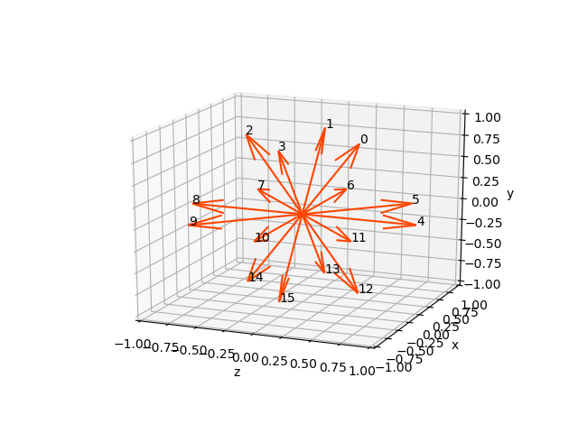

# Deformable Object Grasping
This module provides a framework to automatically perform grasp tests on an arbitrary object model of choice. The details of these grasp tests can be found in our paper "What Makes a Good Grasp on a Deformable Object?". (link to pre-print to be added). For a full example walkthrough, see `examples/example.md`.

There are four different grasp evaluations to choose from ([see Grasp Evaluations section](#types-of-grasp-evaluations)). The user should prepare a mesh of their object of choice as well as an h5 file of all candidate grasps ([see User Inputs section](#user-inputs)). Results of the grasp evaluation are saved in a particular format depending on the evaluation run ([see File Structure section](#results-file-structure-of-h5-datasets))


Example execution of a reorient test on a banana starting from when the desired squeezing force is achieved (x10 speedup).

# Requirements
* [Isaac Gym](https://developer.nvidia.com/isaac-gym)
* [HDF5 for Python](https://www.h5py.org/)
* [Matplotlib](https://matplotlib.org/)

# Installation

## Clone Repo
Clone the repository with
```
git clone git@github.com:NVlabs/DefGraspSim.git

```

## Download necessary files from drive
Note that this repository uses files that are stored on Google Drive and get stored in the `drive_files` folder.
Running the `get_drive_files.sh` script from the root of the repository will download and extact the files to the correct location.
```
cd .../deformable_object_grasping
./get_drive_files.sh
```


## Install Requirements
### Installing Isaac Gym
* Download Isaac Gym from tar ball from https://developer.nvidia.com/isaac-gym/download
* Extract the tar ball
```
cd ~/Downloads
tar -xvzf IsaacGym_Preview_1_Package.tar.gz
```
* Follow the install instuctions in the documentation
```
cd isaacgym
xdg-open isaacgym/docs/index.html
```

### Summary of commands to install Isaac Gym into a Python environment
Here is a summary of the commands to set up a virtual Python environment and install Isaac Gym into that environment.

* Change to the root directory of this repository.
```
cd .../deformable_object_grasping
```

* Install the virtual Python environment tool, `virtualenv`.
```
pip3 install --user virtualenv
```

* Create a new virtual environment called `venv`.
```
virtualenv venv
```

* Activate the `venv` virtual environment.
```
. venv/bin/activate
```

* Install Isaac Gym into the virtual environment.
```
cd .../isaacgym/python
pip3 install -e .
```

* Confirm the Isaac Gym is installed.
```
python3 -c "import isaacgym"
```

### Installing Python packages
The necessary Python packages are automatically installed when installing this package (see the [Installing](#Installing) section below).

## Installing
In the root directory of this repository, run:
```
pip3 install .
```

### Summary of commands to install this package into a Python environment
* Activate the virtual environment (if it is not already active).
```
cd .../deformable_object_grasping
. venv/bin/activate
```

* Install this package
```
pip3 install -e .
```


# Usage
Each grasp test is run for one object and one grasp candidate with the `run_grasp_evaluation` executable script.

For usage summary, run:
```
run_graps_evaluation -h
```

Example usage:
```
run_grasp_evaluation --object=rectangle --grasp_ind=3 --youngs=2e5 --density=1000 --ori_start=10 --ori_end=10 --mode=reorient --write
```

Notes for those who are trying out the code:
- The script generates `(ori_end - ori_start + 1)` environments, so keep this range small for faster runtime on your local machine
- Runtime increases with complexity of meshes. Some examples of simple objects that allow the program to run more quickly are `rectangle`, `sphere_flat_base`, `ellipsoid`.
- The range of elastic moduli have been tested for the range 2e4 - 2e9.
- `pickup` is the grasp evaluation mode with the shortest runtime, and `reorient` is the longest

## `ori_start` and `ori_end` flags
The reorient, linear acceleration (shake), and angular acceleration (twist) tests involve the choice of vector directions. These are 16 regularly spaced vectors in a unit sphere as depicted below. `--ori_start` and `--ori_end` denote the range of vectors to simulate in parallel (inclusive)




# Types of grasp evaluations
There are four different grasp evaluations that can be performed:
1. **Pickup**. The gripper grasps the object and squeezes. Once sufficient force is achieved, the support plane lowers. The evaluation ends once the object is no longer in contact with the plane.
2. **Reorient**. After pickup, the gripper rotates about the associated vector. The evaluation ends once the gripper has rotated by pi radians.
3. **Linear acceleration**. After pickup, the gripper linearly accelerates with a constant jerk in the direction of the associated vector. The test ends once the gripper loses contact with the object.
4. **Angular acceleration**. After pickup, the gripper angularly accelerates with a constant jerk about the associated vector. The test ends once the gripper loses contact with the object.

# Storage of results
When the `--write` flag is set, then the results of each instance of the script are stored in the corresponding object subfolder, ie. in `results/<object_name>.

## Creating master result files
Each time `run_grasp_evaluation.py` is run with the `--write` flag, one file is generated in the `RESULTS_DIR` folder under a subfolder with the object name and an additional (optional) `RESULTS_STORAGE_TAG`. Within the `<RESULTS_DIR>/<object_name>` folder, the results files are automatically sorted into subfolders according to their elastic modulus. Run `make_master_h5s.py` in the root directory. Note that you will have to first change the `OBJ_RESULTS_DIR` in the script to be equal to the `<RESULTS_DIR>/<object_name>` directory of interest. This script will create master files for each type of grasp evaluation within each elastic modulus subfolder. These master files will be named: `pickup_master.h5`, `reorient_master.h5`, `shake_master.h5`, `twist_master.h5`.

## Results file structure of H5 Datasets
All datasets in the h5 files have the first dimension as equal to the number of tested grasps. For each entry (corresponding to each grasp), the following data is stored:

Pre-contact
- pre_contact_stresses: Von Mises stress per tetrahedraon, shape (num_tets,)
- pre_contact_se: Total strain energy, shape (1,)
- pre_contact_positions: Positions of mesh nodes, shape (num_nodes, 3)

Pre-pickup (once desired squeezing force is achieved)
- edge_distances: [left edge_dist, right edge_dist]
- num_gripper_contacts: [left num_contacts, right num_contacts]
- perp_distances: [left perp_dist, right perp_dist]
- pure_distances:  [left pure_dist, right pure_dist]
- gripper_distance_at_force: gripper_sep, shape (1,)
- stresses_at_force: VM stress per tetrahedron, shape (num_tets,)
- se_at_force: Total strain energy, shape (1,)

Post-pickup
- positions_under_gravity: shape (num_nodes, 3)
- stresses_under_gravity: shape (num_tets,)
- se_under_gravity: shape (1,)
- pickup_success: shape (1,)
- gripper_positions_under_gravity (2,)

Reorientation
- reorientation_meshes: All mesh positions recorded during reorientation, shape (16, 4, num_nodes, 3). 16 corresponds to the number of vectors, 4 is the number of rotation angles achieved per vector, 3 is for the xyz positions per node.
- reorientation_stresses:  All mesh stresses recorded during reorientation, shape (16, 5, num_tets)

Linear acceleration
- shake_fail_accs: Acceleration at failure (ie. contact lost) under acceleration along each vector, shape (16,)

Angular acceleration
- twist_fail_accs: Acceleration at failure (ie. contact lost) under acceleration about each vector, shape (16,)

Misc.
- timed_out: Flags whether experiment took too much time to complete, shape (1,)

# User inputs
The user must provide the object mesh in the `.tet` format, as well as a set of Panda hand candidate grasp poses saved in a `.h5` file.

## <object_name>_grasps.h5
The h5 file containing the grasp poses must have the following structure:
* Contain a dataset named `'poses'` containing a numpy array of shape (num_grasp_poses, 7)
* Each grasp pose is a represented as an array of length 7 in the form `[px, py, pz, w, x, y, z]` where `px, py, pz` is the gripper position and `w, x, y, z` are the quaternion components.

## `assets` folder
A subfolder for new object should be added under the `assets` folder and named `<object_name>`. This folder should store  the input files `<object_name>.tet`, `<object_name>_grasps.h5`.
